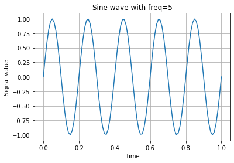

# Computational Intelligence
- Instructor   : [Sepideh Hajipour](http://sharif.edu/~hajipour/)
- Assistant    : [Pooria Ashrafian](https://pooria90.github.io/)

This page accompanies the class material of EE25-729 course at [the Sharif University of Technology](https://en.sharif.edu/). Feel free to write your questions/comments to [my email](pooria.ashrafian@gmail.com).

## A gentle intro to Python

## What we need for preprocessing: `numpy` and `sklearn`

## Visualizations: Intro to `matplotlib`

For our visualizations, `matplotlib.pyplot` is all we need. Let's import the module and set up figure and axes.
```python
import matplotlib.pyplot as plt

fig, ax = plt.subplots()
```
`plt.subplots()` is a function that returns a tuple containing a figure and axes object(s). `fig` is useful for saving what we have drawn using `ax`. 
Now I draw a sine wave to show how `ax` works.

```python
import numpy as np

t = np.linspace(0, 1, 100)
f = 5
x = np.sin(2 * np.pi * f * t)

ax.plot(t,x)
plt.show() # To display open figures; fig in here
```

After running we see this:


Let's make it prettier using `ax`'s methods:

```python
ax.plot(t, x)
ax.set_title(f'Sine wave with freq={f}')
ax.set_xlabel('Time')
ax.set_ylabel('Signal value')
ax.grid(True)
plt.show()
```

There we go:




## Let's get to the point: `pytorch`

## A little bit of genetic algorithms: `pyeasyga`


<!---
You can use the [editor on GitHub](https://github.com/CI-fall21/CI-fall21.github.io/edit/main/index.md) to maintain and preview the content for your website in Markdown files.

Whenever you commit to this repository, GitHub Pages will run [Jekyll](https://jekyllrb.com/) to rebuild the pages in your site, from the content in your Markdown files.

### Markdown

Markdown is a lightweight and easy-to-use syntax for styling your writing. It includes conventions for

```markdown
Syntax highlighted code block

# Header 1
## Header 2
### Header 3

- Bulleted
- List

1. Numbered
2. List

**Bold** and _Italic_ and `Code` text

[Link](url) and 
```

For more details see [Basic writing and formatting syntax](https://docs.github.com/en/github/writing-on-github/getting-started-with-writing-and-formatting-on-github/basic-writing-and-formatting-syntax).

### Jekyll Themes

Your Pages site will use the layout and styles from the Jekyll theme you have selected in your [repository settings](https://github.com/CI-fall21/CI-fall21.github.io/settings/pages). The name of this theme is saved in the Jekyll `_config.yml` configuration file.

### Support or Contact

Having trouble with Pages? Check out our [documentation](https://docs.github.com/categories/github-pages-basics/) or [contact support](https://support.github.com/contact) and we’ll help you sort it out.
--->
